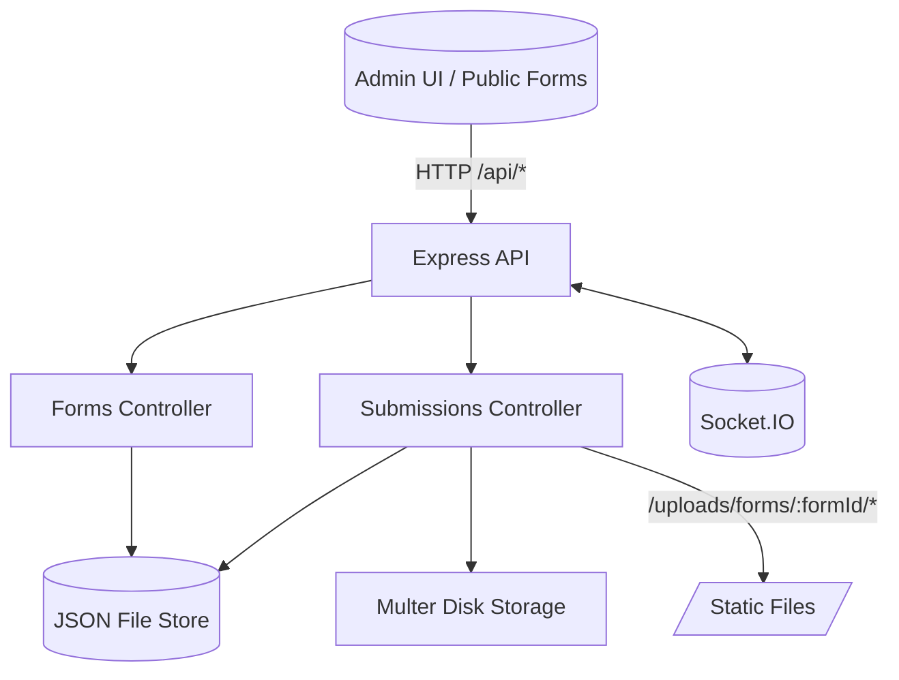

# Form Builder Backend API

Node.js + Express backend with filesystem-backed JSON storage for dynamic form builder.

## Architecture



## Features

✅ **Form Management**
- Create, read, update, delete forms
- Field management with validation rules
- Support for conditional/nested fields
- Drag-and-drop field reordering

✅ **Field Types**
- Text, Textarea, Number, Email, Date
- Checkbox (multi-select)
- Radio buttons (single-select)
- Select dropdown
- File upload support

✅ **Submissions**
- Server-side validation
- IP tracking and metadata
- Status management (pending/reviewed/archived)
- CSV export functionality
- Submission statistics

✅ **Security**
- Input sanitization
- Rate limiting
- CORS protection
- Helmet security headers

## Prerequisites

- Node.js 18+ and npm
- Git

## Installation

1. **Clone and navigate to backend folder:**
```bash
cd backend
```

2. **Install dependencies:**
```bash
npm install
```

3. **Set up environment variables:**
```bash
cp .env.example .env
```

Edit `.env` and configure:
```env
PORT=5000
NODE_ENV=development
CORS_ORIGIN=http://localhost:5173
MAX_FILE_SIZE=5242880
UPLOAD_PATH=./uploads
```

4. **Start the server:**

Development mode (with auto-reload):
```bash
npm run dev
```

Production mode:
```bash
npm start
```

Server will run at `http://localhost:5000`

## API Endpoints

### Forms

#### Get All Forms
```http
GET /api/forms

Query params:
- status: draft|active|archived
- page: number (default: 1)
- limit: number (default: 10)
```

#### Get Single Form (Public)
```http
GET /api/forms/:id
```

#### Get Public Forms (active)
```http
GET /api/forms/public
Query params:
- page: number (default: 1)
- limit: number (default: 10)
```

#### Create Form
```http
POST /api/forms
Content-Type: application/json

{
  "title": "Contact Form",
  "description": "Get in touch with us",
  "fields": [
    {
      "label": "Full Name",
      "type": "text",
      "name": "full_name",
      "required": true,
      "validation": {
        "minLength": 2,
        "maxLength": 100
      },
      "order": 0
    },
    {
      "label": "Email",
      "type": "email",
      "name": "email",
      "required": true,
      "order": 1
    }
  ]
}
```

#### Update Form
```http
PUT /api/forms/:id
Content-Type: application/json

{
  "title": "Updated Form Title",
  "status": "active"
}
```

#### Delete Form
```http
DELETE /api/forms/:id
```

### Fields

#### Add Field to Form
```http
POST /api/forms/:id/fields
Content-Type: application/json

{
  "label": "Phone Number",
  "type": "text",
  "name": "phone",
  "required": false,
  "validation": {
    "pattern": "^\\d{10}$",
    "customMessage": "Please enter a 10-digit phone number"
  },
  "order": 2
}
```

#### Update Field
```http
PUT /api/forms/:id/fields/:fieldId
Content-Type: application/json

{
  "label": "Updated Label",
  "required": true
}
```

#### Delete Field
```http
DELETE /api/forms/:id/fields/:fieldId
```

#### Reorder Fields
```http
PUT /api/forms/:id/reorder
Content-Type: application/json

{
  "fieldOrders": {
    "field_id_1": 0,
    "field_id_2": 1,
    "field_id_3": 2
  }
}
```

### Submissions

#### Submit Form (multipart supported)
```http
POST /api/submissions/:id/submit
Content-Type: multipart/form-data | application/json

{
  "answers": {
    "full_name": "John Doe",
    "email": "john@example.com",
    "phone": "1234567890",
    "country": "USA",
    "interests": ["Technology", "Sports"]
  }
}
```

#### Get Submissions
```http
GET /api/submissions/:formId

Query params:
- status: pending|reviewed|archived
- page: number
- limit: number
- sortBy: createdAt|status
- order: asc|desc
```

#### Get Single Submission
```http
GET /api/submissions/:formId/:submissionId
```

#### Update Submission
```http
PATCH /api/submissions/:formId/:submissionId
Content-Type: application/json

{
  "status": "reviewed",
  "answers": { "field_name": "updated value" }
}
```

#### Delete Submission
```http
DELETE /api/submissions/:formId/:submissionId
```

#### Export Submissions to CSV
```http
GET /api/submissions/:formId/export
```

#### Get Submission Statistics
```http
GET /api/submissions/:formId/stats
```

## Field Types & Validation

### Text & Textarea
```json
{
  "type": "text",
  "validation": {
    "minLength": 2,
    "maxLength": 100,
    "pattern": "^[A-Za-z\\s]+$",
    "customMessage": "Only letters allowed"
  }
}
```

### Number
```json
{
  "type": "number",
  "validation": {
    "min": 0,
    "max": 100
  }
}
```

### Select/Radio
```json
{
  "type": "select",
  "options": ["Option 1", "Option 2", "Option 3"],
  "conditionalFields": [
    {
      "showWhen": {
        "parentFieldName": "country",
        "parentFieldValue": "USA"
      },
      "label": "State",
      "type": "select",
      "name": "state",
      "options": ["CA", "NY", "TX"]
    }
  ]
}
```

### Checkbox
```json
{
  "type": "checkbox",
  "options": ["Choice 1", "Choice 2", "Choice 3"]
}
```

## Authentication

No authentication is required. All endpoints are public.

## Testing

### Manual Testing with cURL

**Create a form:**
```bash
curl -X POST http://localhost:5000/api/forms \
  -H "Authorization: Bearer your-admin-token" \
  -H "Content-Type: application/json" \
  -d '{
    "title": "Test Form",
    "fields": [
      {
        "label": "Name",
        "type": "text",
        "name": "name",
        "required": true,
        "order": 0
      }
    ]
  }'
```

**Submit a form:**
```bash
curl -X POST http://localhost:5000/api/submissions/<FORM_ID>/submit \
  -H "Content-Type: application/json" \
  -d '{
    "answers": {
      "name": "John Doe"
    }
  }'
```

## Error Handling

API returns consistent error responses:

```json
{
  "success": false,
  "message": "Error description",
  "errors": [
    {
      "field": "email",
      "message": "Email is required"
    }
  ]
}
```

## Production Deployment

### Environment Variables (Production)

```env
NODE_ENV=production
PORT=5000
CORS_ORIGIN=https://your-frontend-domain.com
MAX_FILE_SIZE=5242880
UPLOAD_PATH=./uploads
```

## Security Checklist

- ✅ Input validation and sanitization
- ✅ Rate limiting enabled
- ✅ CORS configured
- ✅ Helmet security headers
- ✅ No sensitive data in logs
- ⚠️ Enable HTTPS in production

## Troubleshooting

**Port already in use:**
```
Error: listen EADDRINUSE: address already in use :::5000
```
Solution: Stop the process using port 5000 or set a different `PORT`.

**Validation errors:**
Check that field names are lowercase with underscores only: `field_name`

**CORS errors:**
Update `CORS_ORIGIN` in `.env` to match your frontend URL (Vite default is `http://localhost:5173`).

## License

MIT
