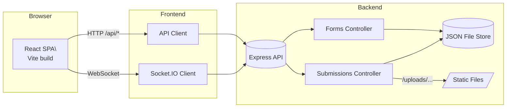

# Dynamic Form Builder — Frontend

Single-page application built with Vite, React, and TypeScript. It provides an admin dashboard to manage forms and a public renderer for active forms, with real-time updates via Socket.IO.

## Tech Stack

- Vite, React, TypeScript
- Tailwind CSS, shadcn-ui
- React Router
- TanStack Query
- Socket.IO client

## Architecture



## Routes

- `/` Home
- `/forms` Public forms list
- `/form/:id` Render a form
- `/form/:id/submissions` View and edit submissions for a form
- `/admin` Admin dashboard (form management)
- `*` Not found

Source: `frontend/src/App.tsx:21–33`

## Environment

- `VITE_API_URL`: Backend base URL (e.g., `http://localhost:5000`)
  - API base resolution: `frontend/src/lib/api-client.ts:17–29`
  - Socket URL resolution: `frontend/src/lib/socket.ts:5–14`

## Getting Started

### Install

```bash
npm install
```

### Run

```bash
npm run dev
```

Frontend defaults to `http://localhost:5173`.

## Scripts

```bash
npm run dev      # start frontend
npm run build    # build
npm run preview  # preview build
```

## Features

- Admin dashboard to create, edit, reorder forms
- Public form rendering with validation (numbers, text, dates)
- Submissions table with edit and status update
- File uploads integrated with backend static serving
- Real-time updates via Socket.IO

